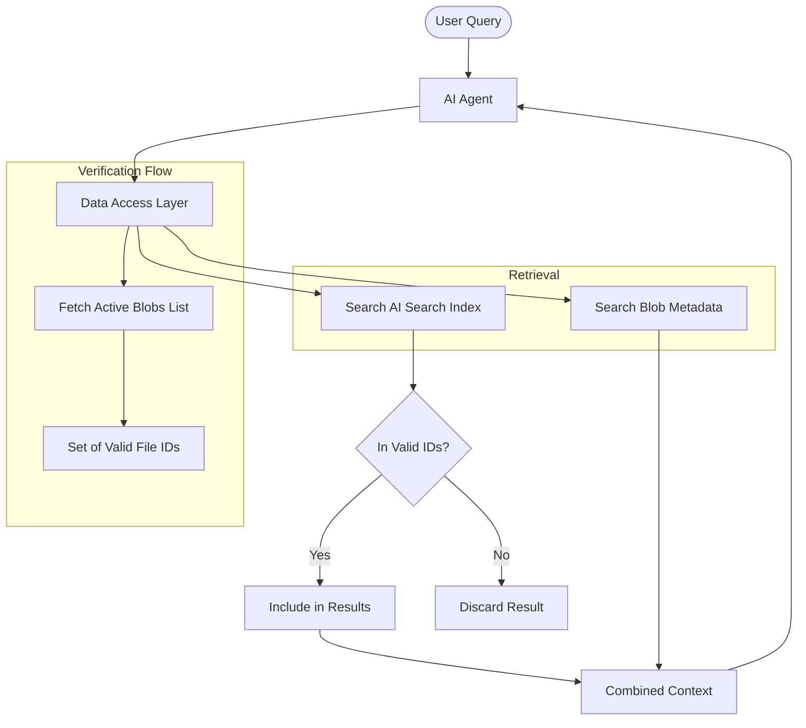

# AI Agent Metadata Architecture

## Overview
The Market Research AI Assistant uses a **Hybrid Metadata Access** strategy to ensure the AI Agent always has an accurate and real-time view of uploaded files, while still benefiting from deep content search via Azure AI Search.

## Why this was implemented
Previously, the AI Agent relied solely on **Azure AI Search (RAG)**. This caused two main issues:
1.  **Sync Lag**: When a file was uploaded, the Agent couldn't see it until indexing was complete.
2.  **Ghost Files**: When a file was deleted from storage, it often remained in the AI Search Index for several minutes, causing the Agent to list files that no longer existed.

## The Solution: Hybrid Access
We implemented a system where **Azure Blob Storage** acts as the **Absolute Source of Truth (SoT)** for file existence.

### Components
1.  **`BlobRetriever`**: Directly queries Azure Blob Storage properties and custom metadata tags.
2.  **`DataAccessLayer`**: The central coordinator that:
    - Fetches the current list of active files from Blob Storage first.
    - Queries AI Search for content matches.
    - **Filters** AI Search results against the active file list. If a file is in AI Search but not in Blob Storage, it is hidden.

### Flow Diagram


## How to Verify
### 1. Developer Verification Script
Run the following from the `backend` folder:
```bash
python verify_blob_retrieval.py
```
This script checks the health of all retrievers and simulates an agent query to ensure deleted files are correctly filtered out.

### 2. Swagger UI
Visit `http://localhost:8000/docs` and use the `GET /api/v1/files/list` endpoint. This list is generated directly from the Source of Truth (Blob Storage).

## Key Files
- `backend/app/blob/retriever.py`: Logic for direct blob listing.
- `backend/app/core/data_access.py`: Integration and strict filtering logic.
- `backend/app/api/v1/endpoints/files.py`: Backend API that populates blob metadata during upload.
